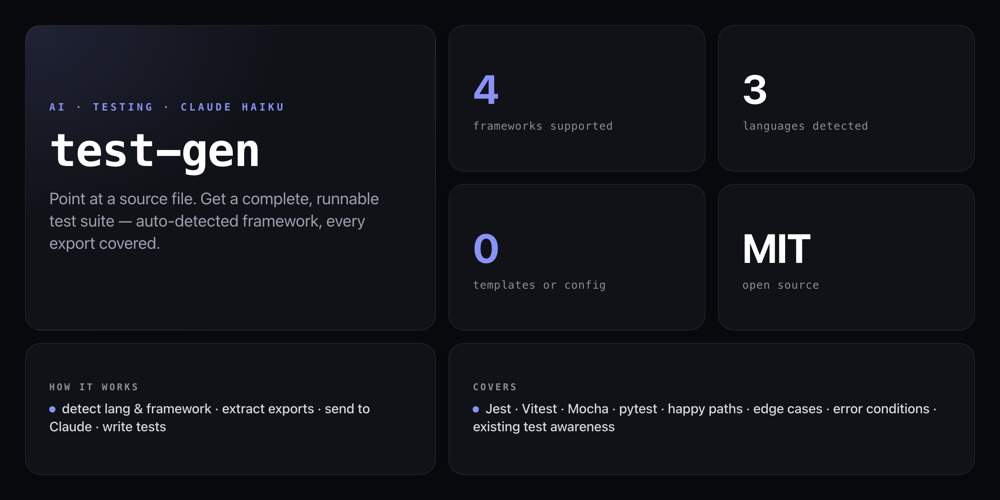

<div align="center">

**Point at a source file. Get a complete, runnable test suite — framework auto-detected, every export covered.**


</div>

---

Writing tests is the task everyone knows matters but nobody wants to do. `test-gen` reads your source file, detects your test framework from `package.json` or config files, extracts every exported function and class method, and uses Claude Haiku to generate complete test suites — happy paths, edge cases, and error conditions included.

No templates, no config, no placeholders. If a test file already exists, it loads it first and avoids generating duplicates. The output is copy-paste ready, or write it directly to a file with `--output`.

```
$ npx github:NickCirv/test-gen src/analyzer.js

Detected: javascript / vitest

Generated 87 lines of tests → tests/analyzer.test.js

import { describe, it, expect, beforeEach, afterEach, vi } from 'vitest'
import { detectLanguage, detectFramework, analyzeFile } from '../src/analyzer.js'

describe('detectLanguage', () => {
  it('returns javascript for .js files', () => {
    expect(detectLanguage('app.js')).toBe('javascript')
  })

  it('returns typescript for .ts and .tsx files', () => {
    expect(detectLanguage('index.ts')).toBe('typescript')
    expect(detectLanguage('Component.tsx')).toBe('typescript')
  })

  it('returns python for .py files', () => {
    expect(detectLanguage('main.py')).toBe('python')
  })

  it('returns null for unsupported extensions', () => {
    expect(detectLanguage('style.css')).toBeNull()
  })
})
```

## Install

No npm account needed — runs straight from GitHub:

```bash
npx github:NickCirv/test-gen src/utils.js
```

## Usage

```bash
# generate tests to stdout
npx github:NickCirv/test-gen src/utils.js

# write directly to a test file
npx github:NickCirv/test-gen src/api/user.ts --output tests/user.test.ts

# override the detected framework
npx github:NickCirv/test-gen app/services/payment.py --framework pytest
```

| Flag | Description | Default |
|------|-------------|---------|
| `--output <path>` | Write tests to a file instead of stdout | stdout |
| `--framework <name>` | Override auto-detected framework (`jest`, `vitest`, `mocha`, `pytest`) | auto-detect |

## How it works

1. **Detect language** from the file extension (`.js`, `.ts`, `.tsx`, `.py`, etc.)
2. **Detect framework** by walking up the directory tree — reads `package.json` dependencies, `vitest.config.*`, `jest.config.*`, `.mocharc.*`, `pytest.ini`, `conftest.py`
3. **Extract exports** — named functions, arrow functions, classes and their methods; Python public functions and classes
4. **Load existing tests** if a test file is already present — avoids regenerating covered cases
5. **Generate with Claude Haiku** — sends source + export map + framework guidance; returns complete runnable test code

## Supported languages and frameworks

| Language | Extensions | Frameworks |
|----------|-----------|-----------|
| JavaScript | `.js`, `.jsx`, `.mjs`, `.cjs` | Jest, Vitest, Mocha |
| TypeScript | `.ts`, `.tsx`, `.mts` | Jest, Vitest, Mocha |
| Python | `.py` | pytest |

Framework is auto-detected from project config files. Falls back to Jest (JS/TS) or pytest (Python) when no config is found.

## Requirements

- Node.js 18+
- `ANTHROPIC_API_KEY` environment variable

## What it is NOT

- **Not a test runner.** It generates the file — you run it with your existing test setup.
- **Not a replacement for understanding your code.** The output is a starting point: review it, fill in mocks for your specific dependencies, and extend it.
- **Not zero-cost.** Every generation call uses Claude Haiku tokens — fast and cheap, but not free. Each file analysis typically costs a fraction of a cent.

---

<div align="center">
<sub>Node 18+ · MIT · by <a href="https://github.com/NickCirv">NickCirv</a></sub>
</div>
